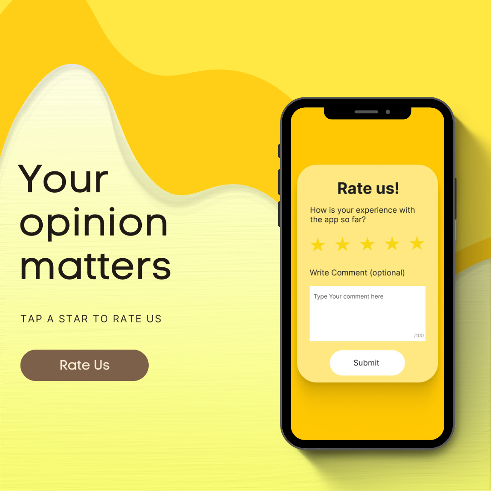
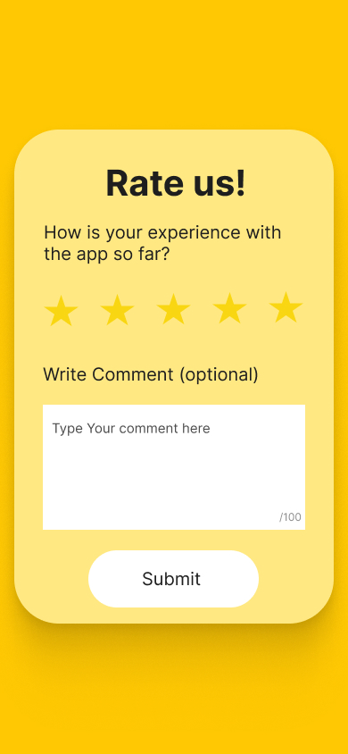
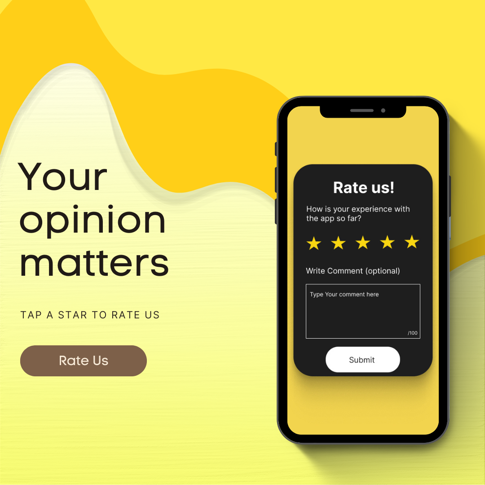
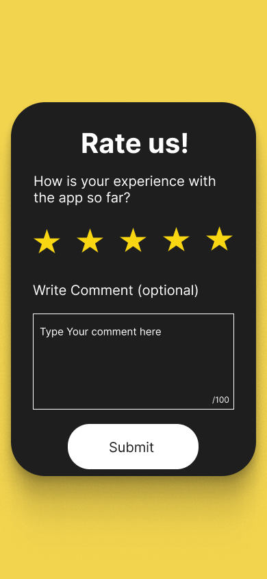
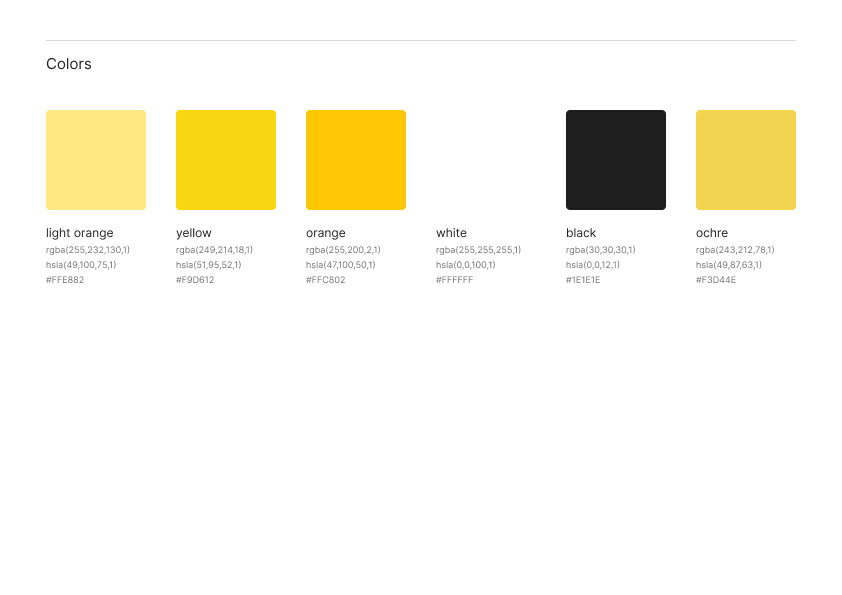

# 📱 Rate Us Popup – Elevvo Task 2

This project is a **"Rate Us" popup interface** designed for mobile applications.  
It was created as part of **Elevvo Task 2** using **Figma** and **Canva**.  
The popup lets users quickly rate the app and leave feedback, available in both **light** and **dark** themes.

---

## ✨ Features

- ⭐ **5-star rating system**
- 📝 **Feedback text box** for user comments
- 📤 **Submit button** to send feedback
- 🌞 **Light theme** and 🌙 **Dark theme** versions
- 🎨 Simple and mobile-friendly design

---

## 🛠️ Tools Used

- **Figma** – for UI/UX design
- **Canva** – for presentation & mockups

---

## 📸 Preview

### Light Theme

### Dark Theme

---

### Color Style

---

## 🚀 How to View

1. Open the design files in **Figma**.
2. Explore both themes and the interaction flow.

👉 [Figma Link](https://www.figma.com/design/hw1oERyTpjCOf8oUn2hfXJ/Task1-3?node-id=64-4&t=B2akot0G6x1iHgUe-1)

---

## 🏷️ License

This project was created for **Elevvo – Task 2**.  
Free to use for **learning** and **portfolio** purposes.
